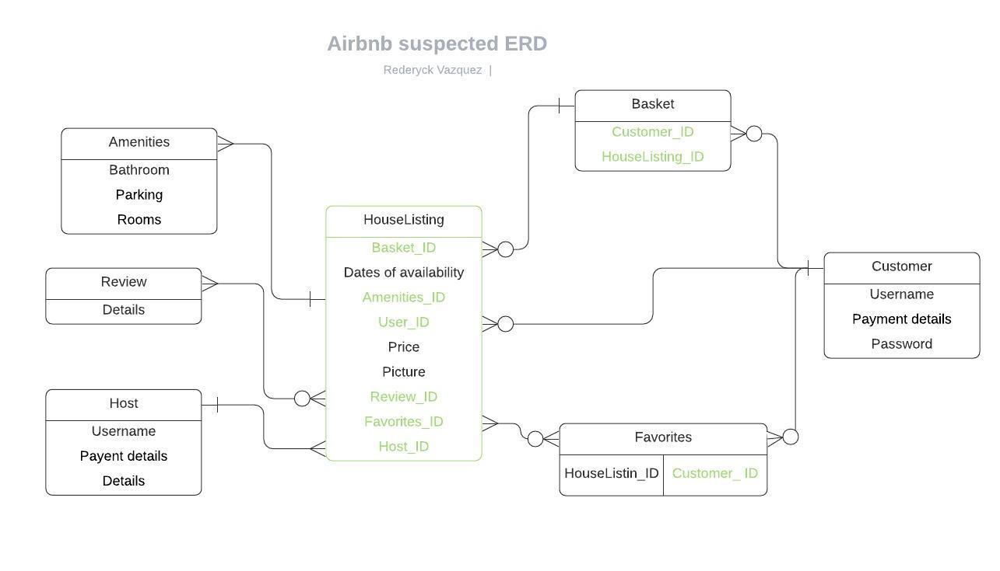

Assessment 2

# Question 1 
https://adrianmejia.com/ruby-on-rails-architectural-design/
* Describe the architecture of a typical Rails application

Rails is a web application development framework which adheres to a rule of convention over configuration. This allows programmers to be more productive as structure of the program is prefabricated allowing for more time to focus on the programs content. The rails framework is comprised of the model, view and controller also known as MVC. The model contains the logic of data being handled by the code framework. It allows for the manipulation and validation of data being stored as well as being passed to and from the client. The view is concerned with rendering the data from the server into a meaningful "view" for the end client. 

Apart from convention over configuration, rails philosophy also involves the DRY principle. DRY, which stands for do not repeat yourself encourages programmers to reduce the lines of code they write, by developing unambiguous code, which can be reused throughout the program. This allows for a less buggy, easy to maintain and efficient code.

# Question 2
https://www.techopedia.com/definition/1178/data-independence
https://thenewstack.io/why-and-when-you-need-transactional-ddl-in-your-database/
https://www.aalpha.net/blog/pros-and-cons-of-using-postgresql-for-application-development/

* Identify a database management system (DBMS) commonly used in web applications (including Rails) and discuss the pros and cons of this database

Database management systems enables users to store, create, retrieve, edit and delete data. DBMS allows for data independece, which permits for a logical schema to be modified, without affecting the structure of the next level data structure. Data independence also means that data is stored at a different location rather than within the application, allowing for more versatile use of data and a more portable and efficient application. 
An example of a widely used database management system is postgresql.

Postgresql has several benefits compared to other databases such as, transactional DDL, extensibility and security. A transactional DDL is concerned with a group of operations observing ACIDity (atomic, consistent, isolated and durable) being treated as a single operation. This grouping of transactions enable better responsiveness and flexibility to application problems, as programmers will be able to rollback to a previous working code and resolve the issue, without interrupting the functionality and accessibility of the entire application. Extensibility refers to the ability of postgresql to install multiple extensions allowing the user to execute additional functions, that may not even be the main language used by the programmer, which does not pose as a problem since postgresql handles the functionality automatically.
Security wise  postgresql provides parameter based security wherein database can be locked down at an OS level. Application security is also delivered through the basis of segregated user privileges.

Some of postgresql's limitations involve a strict database structure, wherein a schema cannot consist of new data until it's column has been defined prior to addition. This structure may also lead to a slower performace when running a query on a large scale databse, as the query will have to be run through numerous rows and columns. Postgresql is also an open source software, which means it is run by the community, this implies a lack of warranty and indemnity protection.

# Question 3 
https://www.smartsheet.com/comprehensive-guide-values-principles-agile-manifesto
https://www.dummies.com/careers/project-management/applying-agile-management-value-2-working-software-over-comprehensive-documentation/
* Discuss the implementation of Agile project management methodology

Agile is a methodology which adheres to four values. 

### 1)Individuals and Interactions Over Processes and Tools. 

   Promotes a smoother flow of communication between team members and customers allowing for faster reactions when change must be done to a project, as in the case of process these conversations will be scheduled and may be limited to specific topics of discussion making reactions to changes sluggish.

### 2)Working Software Over Comprehensive Documentation,

   Rather than developers dedicating a huge and particular amount of time in documentation,which may retard the progress of project development this encourages workers to streamline documentation. Developers create documentation on the go, normally depicting the requirements of the project and technical specifications as to how the individual approached creating the project. This method allows easier identification of potential issues as assessment is concurrent with development of the application.

### 3)Customer Collaboration Over Contract Negotiation
  
  Collaboration allows the customer and developers to constantly monitor and guide the direction of the project, this proves to be more flexible as any issues that may arrise can be quickly discussed and resolved. This also provides a realistic perception of how the project will turn out. Since negotiation occurs periodically, it is less flexible as the customer normally presents expectation before the project even begins. Customers are not as involved in the development process, which may lead to unmet expectations and unexpected changes which can cause delays.
  
### 4) Responding to Change Over Following a Plan.

   With the agile methodology, teams work on small segments of a project at a time, rather than spreading the team across a wide plain. This again enables the team to be more reactive as resources can be moved to specific parts of the project when required. The ability to make the project fit the team also can increase productivity and ingenuity as interplay of ideas is more likely to occur when tackling projects in a more focused group.

# Question 4 
https://www.perforce.com/blog/vcs/what-source-control
* Provide an overview and description of a standard source control workflow

Source control is a crucial part of coding, especially for development teams. This allows for a source of truth for the developers working on a particular code. Source control paves a path for collaborations, as it enables multiple programmers to work a similar code base, where there will be no conflict if any of the developers commit or merge code. History of code alterations are also recorded in order to manage versions of the code, in case an update causes errors or bugs.

 A standard workflow for source control involves, creating a new project, coding, add it to the staging area, commit the staged changes to local repository, create an online repository and push your file to that online repository. Otherwise if a user plans to add a new feature or create a bug fix he/she must create a new branch which will not affect the master, and merge that branch if no issues arise, or continue working on a separate branch.

# Question 5 
https://reqtest.com/testing-blog/the-a-to-z-guide-to-the-software-testing-process/
https://www.toolsqa.com/software-testing/test-process-in-software-testing/
* Provide an overview and description of a standard software testing process (e.g. manual testing) 
Testing is the activity wherein actual results are compared to target results. With software development it assists in identifying any errors or gaps which a developer can rectify or improve to achieve a product which is closer to the finished good. Testing does not guarantee a bug free software, but allows to ensure that integral parts of the software are functional for the end user. The testing process can either be manual or automated. Each with its merits such as manual testing is favorable for exploratory testing, as automated testing is scripted it can only execute what has been programmed, while manual testing allows for experience, creativity and intuition to play a role allowing for different approaches.
Performance and reapeated testing is where automated testing shines, as a computer can execute code faster than humans.
A common approach to manual testing is:
### 1)Testing Strategy and Planning
   Understand the nature and code of the application that is about to be tested. Create documentation on how to approach the testing phase.
### 2)Test Designing
   Create drafts of test cases, which encompasses areas which requires testing of the application under test (AUT).
### 3)Test Execution
   Execute the code in the AUT, record any new bugs or improvements, report it to the developer for rectification and test the application again to see if all issues are rectified.
### 4)Test Closure
   Document any code changes and monitor the applications real time performance after redeployment.

# Question 6
https://www.proserveit.com/blog/information-security-requirements 
* Discuss and analyse requirements related to information system security and how they relate to the project

Applications handle numerous data, some of which are sensitive information. Security is an obligation which must be considered when developing an application. The security triad which involve confidentiality, integrity and availability, are guidelines to determine if an application is secure.

Confedentiality refers to the restriction of data access to those with permission to see it. Integrity assures that any data being accessed has not been altered by people with no access and represents what is actually intended. Availability  is the ability of data to be accessed and modified by users with permissions.

 Security obligation can be categorized into three sections namely business, regulatory and customer. When developing the application it is a must that the triad is upheld with each of these sections in mind, as each may have a specific requirement, which are unique from one another.

 An example for business would be to store and limit access to its database based on user permission to preserve integrity and confidentiality. Regulatory may vary from different governing bodies, wherein the application must be compliant with certain legislations. Security commitment by data encryption of sensitive inputs is an example of customer obligation.
# Question 7
https://gdprinformer.com/gdpr-articles/6-essential-data-protection-methods
* Discuss common methods of protecting information and data and how you would apply them to the project

Common methods to protect data involve but are not limited to pseudonymisation, encryption, destruction, backups and access control.

Pseudonymisation and encryption are closely related a key difference is that with a given data, encryption changes the entire data into non understandable text in relation to a specific key. Psuedonymisation only replaces "key" fields or sensitive aspects of the data, but still making some of it accessible and readable. Encryption will be used for full access restriction of information while psuedonymisation willbe used for less sensitive data.

 Destruction ensures that any data is purely deleted esuring that any unrequired information can no longer be accessed and is irrecoverable, normally done by degaussing of hard disks. 
 Access control is concerned with the limitation of people within the company whom has access to particular data. Access control is mainly related to the workflow of the business rather than the application.
 Lastly backups provide integrity as it presents as a reserve if any data is corrupted or lost due to technical malfunction or user error.

# Question 8
https://www.business.gov.au/Risk-management/Cyber-security/How-to-protect-your-customers-information
* Research what your legal obligations are in relation to handling user data and how they can be met for the project

A business must be responsible for protecting customers information from things such as theft, misuse, modification and disclosure. This concept passes on to their application, although certain specificities may vary depending on location as different areas have various legalities.

In order to uphold the basics of handling user data the application must be again placed under the scrutiny of the security triad during development. Incorporating encryption for user information, restricted access to user information and non disclosure of captured data to third party are some of the features that an application that can show compliance to these regulations.

Again regulatory requirements can vary from different locations, an example for Australia that an application must adhere to is that user diclosures must not contain overriding qualifiers, as it may lead to misleading to consumers, when they agree to the terms of using an application.
# Question 9

https://www.guru99.com/relational-data-model-dbms.html

* Describe the structural aspects of the relational database model. Your description should include information about the structure in which data is stored and how relations are represented in that structure.

Relational database models are simply data represented as a collection of relations or table of values. The table is composed of a name, tuple and column. The column represents each of the attributes a data must comprise of, while each row identifies a particular set of related data within that particular table, which is normally identified through the primary key.
The model is a separate entity from the relational database management system, which enables the manipulation of stored data. Examples of RDM are Oracle, SQL adn DB2. The simple layout of relational database makes it scalable, data retrieval is also easier as it is information is organized. Different tables can also be connected through special join cases such as foreign keys, allowing for more dynamic and meaningful results during queries.

# Question 10
https://www.techopedia.com/definition/811/data-integrity-databases

* 	Describe the integrity aspects of the relational database model. Your description should include information about the types of data integrity and how they can be enforced in a relational database.

Relational integrity refers to the conditions required in order to uphold meaningful relations. It is divided into three categories domain constraints, key constraints and referential integrity constraints. Domain constraints state that columns of a relational database must be defined and that every column definition must be unique along with its data type being declared. Key constraints dictates that every row must have it's own unique primary key and a primary key must not be null. 
While referential integrity permits foreign keys to be in two states, first is as a primary key of another table and second is it being null, which represents no relationship to another table.
These rules being implemented allow for a well defined and reliable data structure, as the paramaters ties down each data input at a particular section of the table.
# Question 11

* Describe the manipulative aspects of the relational database model. Your description should include information about the ways in which data is manipulated (added, removed, changed, and retrieved) in a relational database.

   Database management systems are responsible for manipulating the data within a database model. SQL or structured query language is a commonly used language by these management systems in order to handle data.Database management systems utilizing SQL such as Postgresql is an improved version, which support additional functionalities such as support of unicode characters, additional options for setting triggers and support for arrays. SQL was specifically made to handle databases, as it has builin statements with particular syntaxes to create, edit, delete and retrieve data. Some of the crucial commands built in to SQL involve select,update,delete,insert into,drop table, create table, create index and create database. These commands must then be executed in a strict arrangement in order to obtain meaningful results. An example of a common SQL query to update is placed below.
   (UPDATE nameOfTable)
   (SET    parameterOfDataToBeChanged)
   (WHERE  primaryKeyofData)

# Question 12
https://www.toptal.com/developers/sorting-algorithms

* Identify and explain the workings of TWO sorting algorithms and discuss and compare their performance/efficiency (i.e. Big O)

A sorting algorithm enables the rearrangement of an array of data in a particular pattern, through the use of comparison operators. The sorting of data is crucial as it optimizes the efficiency of other algorithms, mainly the search algorithm. As a sorted database enables for faster location of data and produces a more readable output. Sorting algorithms include and is not limited to the ff: selection sort, bubble sort, insertion sort, merge sort, quick sort, heap sort and radix sort.

In order to measure the performance of these algorithms the Big-O notation is used. Big-O implies how code complexity is affected by the amount of input being handled by code. Complexity normally insinuates the time it takes to execute the code as well as the space utilized by the algorithm. For comparison let us use the merge sort and the quick sort. 

Merge sort is an external algorith for the fact that it divides the element into two subarray repeatedly until a single element is left, which requires additional storage due to the potential scale of input. It makes use of three arrays, the first two to store the subarrays and the last to store the result.
Quick sort on the other hand is an internal algorithm, although it also uses a divide and conquer method the main difference is that quick sort compares all values to a pivot value.

At worst case time complexity quick sort has a value of O(n2) while merge sort has O(nlogn). This is mainly due to quick sort having to compare each value to a pivot before allocating the value to the correct placement. In terms of space complexity on the otherhand merge sort falls short, as it requires extra storage for all the subarray it produces. 

Refering back to time complexity O(logn) is beneficial for large scale application as time has a linear growth despite n growing exponentially. Quick sort despite having O(n2) is still a good option as it is occupies less space and is local, and will still be efficient for smaller arrays, compared to other sorting algorithms especially bubble sort.
# Question 13
https://www.studytonight.com/data-structures/selection-sorting 
https://www.geeksforgeeks.org/searching-algorithms

* Identify and explain the workings of TWO search algorithms and discuss and compare their performance/efficiency (i.e. Big O)	

Searching algorithms are used in order to retrieve or check for an element in any given datastructure based on passed parameters. Search operations are divided into two categories sequential search and interval search. Sequential search as the name suggests traverses a list of data sequentially, wherein every element is searched until the required one if located. Interval search targets the center of a data set repeatedly dividing the search space in half, although interval searches are designed specifically for sorted data-structures.

Based on Big O notation time complexity wise sequential or linear search has a value of O(n) as the times an operation will be conducted is linear with regards to the amount of data input. In general terms the code is neither efficient nor useless, although it is important to note that it is able to handle unorganized data sets unlike interval searches making it flexible. This search algorithm can still be used for small scale operations.

Regarding interval searches it has a value of O(log N). This implies that its benefits are seen as data being parsed becomes bigger of scale. Since data being traversed from the middle point of the array, work can be cut in half during every iteration. This would mean that as data input grows the time it takes to conduct the search is proportional to log of input, which is better for bigger sets of data when compared to O(n). 
Although ideal for larger sets, for a small sample would not be an ideal application as the processes will be too robust, where a simple linear search may suffice. Also a requirement for interval searches though is that the data being traversed must be organized, as it relies on the middle value being the median of an array, which if it is not will not make sense and can cause errors.
# Question 14
https://www.bernardmarr.com/default.asp?contentID=708
https://www.nextplatform.com/2015/09/10/airbnb-shares-the-keys-to-its-infrastructure/
https://www.techinasia.com/talk/airbnb-help-user-find-results
https://www.quora.com/What-is-the-difference-between-Hadoop-HIVE-and-PIG
  * a. List and describe the software used by the app.
  * b. Describe the hardware used to host the app.
  * c. Describe the interaction of technologies within the app
  * d. Describe the way data is structured within the app
  * e. Identify entities which must be tracked by the app
  * f. Identify the relationships and associations between the entities you have identified in part (e)
  * g. Design a schema using an Entity Relationship Diagram (ERD) appropriate for the database of this website (assuming a relational database model)
  Airbnb is a marketplace app which allows the connection of hosts with travellers, providing them with a place to stay in exchange for money. Below is a breakdown of their application.
  ##### a)
  Airbnb was created through the use of Ruby on Rails, javascript, html, css and ajax. Ruby on Rails allowed for the application to be deployed faster as Ruby on Rails has a convention over configuration practice, allowing developers to focus on features of the application. Javascript, CSS and HTML work together in order to create a dynamic and visually engaging application.
  ##### b)
   Since day one Airbnb was hosted through the use of Amazon Web Services. This proved to be beneficial as Airbnb client base expanded so did the system storage requirements. AWS also provides extra features such as elastic load balancing (EC2), Amazon simple storage service (Amazon S3), elastic map reduce (Amazon EMR) and much more. All of which assists the application to handle multiple requests efficiently and effectively.
  ##### c) 
  Ruby on rails acts as a backbone for the processes and execution of code, based on the users inputs and requirements. The other codes such as javascipt, css, ajax and html act as supplements in order to create a more responsive and efficient application. Since applcations have the tendency to expand as demand grows, a scallable database is required in this case AWS. Rails along with a database management system and the extra features of AWS generates an environment which is responsive and effective in terms of functionality and resource allocation.
  ##### d) 
  Airbnb stores roughly 1.5 petabytes of data. These datas are normally a mix of strings and images. In order to get the most efficient result for querying Airbnb has used a combination of storage where the main storage is Hadoop. The Hadoop framework allows for scalability it also work well with associating unstructured data such as images and locational data. In order to provide a platform for  structured data Hive was utilized as it can mimic SQL performance and stored particular data into tables. This combination on a single platform allows for efficient relational querying.
  ##### e)
  Airbnb must track numerous datas such as users, listing, prices, location, reviews, dates, payment details, amenities, favorites, host, photos and payments. These are just some of the obvious data that may be tracked.
  ##### f)
  Based on the details above, listing will contain, price, photos, reviews,location and dates of availability. User will then be a separate entity which will contain details such as name, address, username and  password,which can be associated to a listing directly or it can be associated to a listing through a cart or favorites entity. 
  ##### g)
  